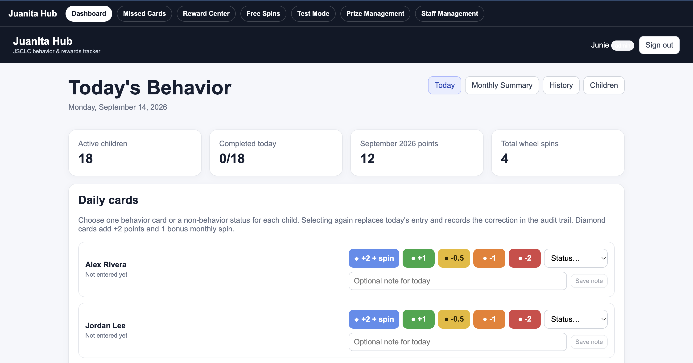
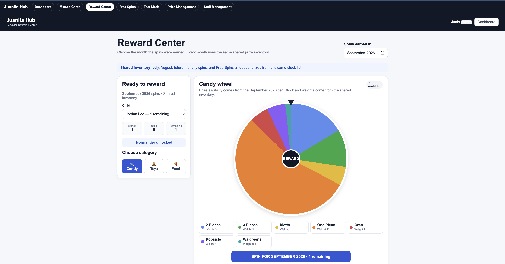
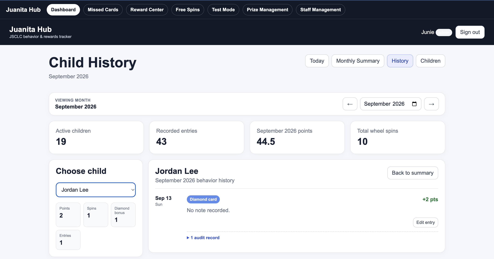

# JuanitaHub — Behavior & Rewards Management Platform

JuanitaHub is a staff-facing web application for recording daily behavior/status entries, tracking monthly progress, managing child rosters, and supporting a points-based rewards workflow.

It was built as a practical internal tool for a real community program and is designed around quick daily use, clear history, and role-aware staff/admin workflows.

**Live deployment:** https://juanitahub.vercel.app

> Staff functionality requires an authenticated and activated account. Screenshots below use fictional/demo names and are presented for portfolio purposes.

## Screenshots

### Daily behavior dashboard



The main dashboard gives staff a quick view of participation, points, wheel spins, and daily behavior/status entry controls.

### Reward Center



The Reward Center combines earned-spin tracking, tier eligibility, shared prize inventory, weighted reward selection, and category-based prizes.

### Child history and audit trail



History views provide month-level totals and individual child records, including editable entries and an audit trail for corrections.

## Tech stack

- Next.js 16
- React 19
- TypeScript
- Supabase (authentication + database)
- CSS
- Vercel deployment

## Key features

- Staff authentication with Supabase Auth
- Staff profiles with `staff` and `admin` roles
- Daily behavior-card and status entry workflows
- Create, edit, archive, and reactivate child records
- Monthly summaries and per-child history
- Points calculations and reward-wheel spin logic
- Admin-only roster management
- Persistent data stored in Supabase
- Audit-friendly correction workflow for existing entries
- Responsive staff dashboard and reusable React components

## Application structure

The app uses the Next.js App Router and separates reusable interface features into components such as:

- `HistoryEntryList`
- `DailyCardNotes`
- `RewardWheel`
- `SiteNavigation`
- Admin/reward shortcuts

Supabase is configured through environment variables rather than hard-coded credentials.

## Local setup

1. Clone the repository.
2. Install dependencies:

```bash
npm install
```

3. Create a local environment file with the required Supabase values:

```text
NEXT_PUBLIC_SUPABASE_URL=your_supabase_url
NEXT_PUBLIC_SUPABASE_PUBLISHABLE_KEY=your_publishable_key
```

4. Start the development server:

```bash
npm run dev
```

5. Open `http://localhost:3000`.

## Deployment

The project is deployed with Vercel. Production environment variables should be configured in the deployment environment rather than committed to the repository.

## What this project demonstrates

This project demonstrates full-stack application development with authentication, database-backed CRUD operations, role-based behavior, data aggregation, reusable React components, audit-aware workflows, and deployment of a production-style web application.
